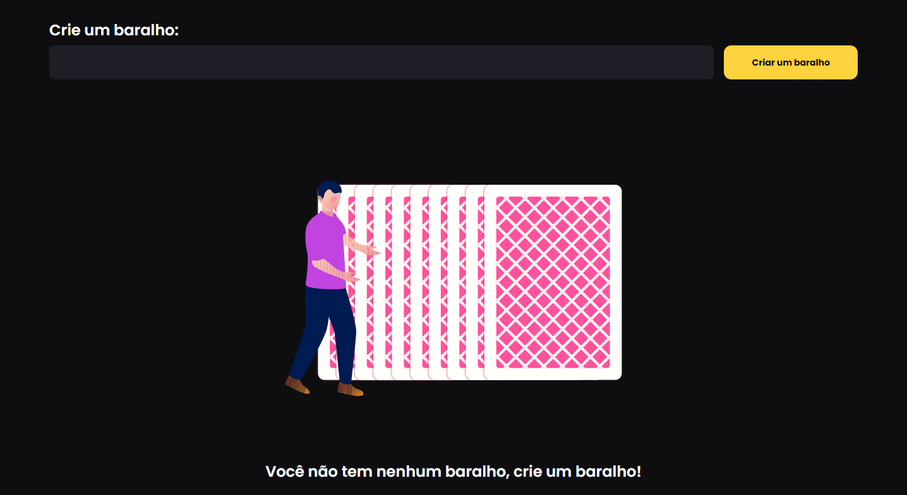
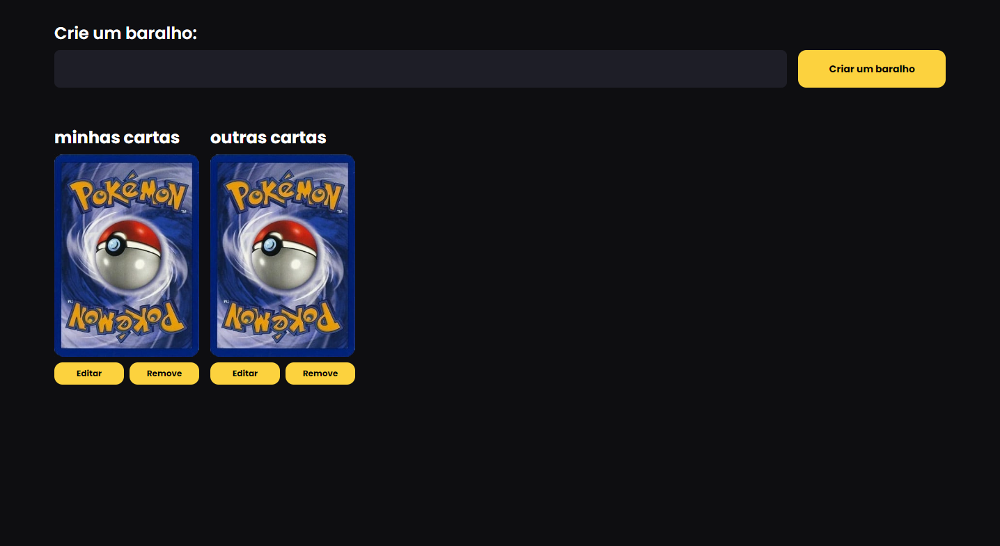
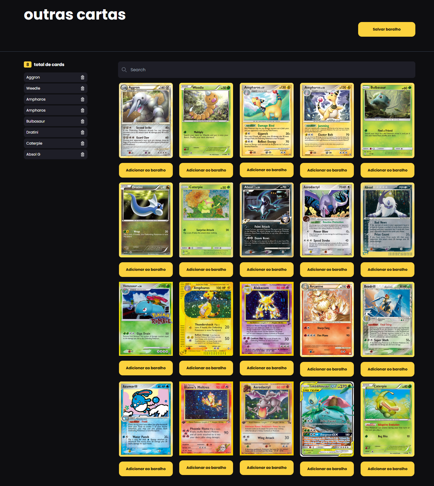

# Decks

Esse proejto foi gerado com [Angular CLI](https://github.com/angular/angular-cli) versão 17.3.5.

## Development server

Rode `ng serve` para o servidor de desenvolvimento. Navegue para `http://localhost:4200/`. A aplicação irá automaticamente recarregar se você fazer qualquer mudança nos arquivos.

## Build

Rode `ng build` para fazer build do projeto. O artefatos do build irá ser salvo na pasta `dist/`.

## Tela inicial e de criação do baralho

A tela abaixo é a inicial sem nenhum baralho, com um input para sua criação.

Após criar os baralhos será semelhante à imagem abaixo

- O botão de editar irá para a página de edição.
- O botão de deletar irá remover o baralho.
- **Clicando na foto** do baralho irá para a tela de detalhes.

## Tela de edição e customização das cartas do baralho.

- Adicione no mínimo 24 cartas ou no máximo 60 e **clique no botão salvar**
- As cartas são carregadas de forma de paginação com o recurso "infinite scroll", como se fosse uma timeline.
- o painel lateral serve para ver a quantidade de cartas e as cartas selecionada, caso repita mais de 4 vezes o nome, é possível removê-la.

## Tela de visualização.

